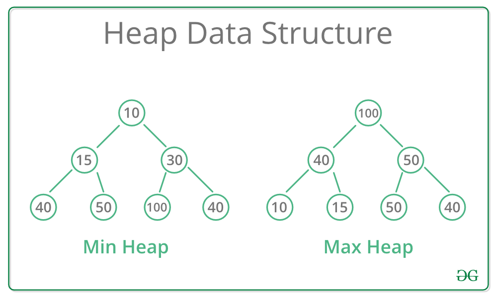
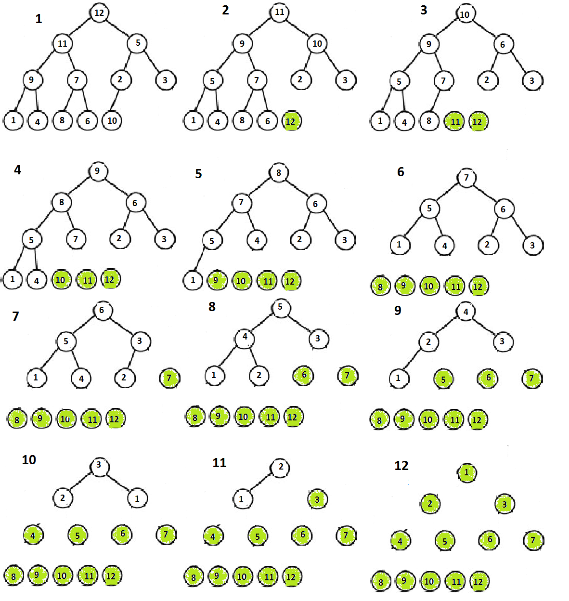

## heap

### 1.what is heap? (copy from geekforgeeks)

* A Heap is a special Tree-based data structure in which the tree is a complete binary tree. Generally, Heaps can be of two types:

* Max-Heap: In a Max-Heap the key present at the root node must be greatest among the keys present at all of it’s children. The same property must be recursively true for all sub-trees in that Binary Tree.

* Min-Heap: In a Min-Heap the key present at the root node must be minimum among the keys present at all of it’s children. The same property must be recursively true for all sub-trees in that Binary Tree.

**堆**

* 堆是一个数组存储完全二叉树的关系，有两种情况，存储最大堆和最小堆。

&#8195;如图：



### 2.heap useage

**设 len 为数组长度,i为某一个节点索引**

* 获取堆的倒数第二排的最后节点（倒数第二层，有孩子的）： n/2 - 1(一般是右节点)

* 获取当前节点的左孩子: 2*i + 1

* 获取当前节点右孩子: 2*i + 2

* 获取当前节点父节点： (i-1)/2

**heapify函数和build heap**

```c
void heapify(int* arr,int n,int i){
	int largest = i;
	int l = 2*i + 1;
	int r = 2*i + 2;

	if (l<n&&arr[l]>arr[largest])
		largest = l;

	if (r<n&&arr[r]>arr[largest])
		largest = r;

	if (largest != i){
		// swap(arr[i],arr[largest]);
		int tmp = arr[i];
		arr[i] = arr[largest];
		arr[largest] = tmp;
		
		heapify(arr,n,largest);
	}
}


int main(){
	int arr[]={5,1,4,6,8,3 };
	int n = sizeof(arr)/sizeof(arr[0]);
	for (int i = n/2-1;i>=0;i--)
		heapify(arr,n,i);
	
	for (int i=0;i<n;i++)
		std::cout<<arr[i]<<" ";
	std::cout<<std::endl;
	return 0;
}
```

&#8195;build heap 简单来说，就是从底层开始构建最大堆。从最后一个节点开始，变成最大堆，然后再往上走。上游发现父节点不是最大的，就交换，然后递归传交换的子节点，给那个父节点安排位置。

&#8195;堆结构非常特殊，顶层的节点永远排在前面，每一层左节点永远在前面。所以从底层开始建立堆结构，只需要从倒数第二排节点最后一个右节点依次往前面遍历就好了。

**heapsort 堆排序**

```c
#include<iostream>

void heapify(int* arr,int n,int i){
	int largest = i;
	int l = 2*i + 1;
	int r = 2*i + 2;
	
	if (l<n&&arr[l]>arr[largest])
		largest = l;

	if (r<n&&arr[r]>arr[largest])
		largest = r;

	if (largest != i){
		// swap(arr[i],arr[largest]);
		int tmp = arr[i];
		arr[i] = arr[largest];
		arr[largest] = tmp;
		
		heapify(arr,n,largest);
	}
}

void heapsort(int* arr,int n){
	for (int i = n/2-1;i>=0;i--)
		heapify(arr,n,i);

	for (int i=n-1;i>0;i--){
		int tmp = arr[0];
		arr[0] = arr[i];
		arr[i] = tmp;

		heapify(arr,i,0);
	}
}

int main(){
	int arr[]={5,1,4,6,8,3};
	int n = sizeof(arr)/sizeof(arr[0]);

	heapsort(arr,n);

	for (int i=0;i<n;i++)
		std::cout<<arr[i]<<" ";
	std::cout<<std::endl;
	return 0;
}
```

&#8195;堆排序是在建立堆的基础上完成的。其实非常简单，每次我们把堆的首元素放到数组尾巴，然后用索引限制在最后元素之前，进行递归堆排序。

&#8195;大致的意思就是，每次都用建立堆（heapify）得到最大的那个元素，然后把这个元素放到末尾，且当前数组长度减一。(使数组尾最大的那个不被访问到) 接着再进行建立堆找到最大的元素，重复之前的步骤。

* 流程图：



**最大优先队列和最小优先队列**

&#8195;heap还可以用来做最大优先队列和最小优先队列。最大优先队列可以用于共享计算机系统的作业调度，每次会先执行优先度最高的任务。最小优先队列常用于事件驱动模拟器，它的事件有时间做关键字。时间必须按照发生的时间顺序进行模拟。

&#8195;现在先以最大优先队列为主，它的支持一下操作：

* INSERT(S,x) 把x插入到集合S

* MAXIMUM(S) 返回S中具有最大关键字的元素

* EXTRACT-MAX(S) 去掉并返回S中的具有最大关键字的元素

* INCREASE-KEY(S,x,k) 将元素x的关键字增加到k

&#8195;最大优先队列在维护过程中一直保持最大堆性质。下面一一介绍：

* MAXIMUM(S)

&#8195;因为本来就有最大堆性质，所以第一个元素已经是最大的了，直接返回即可。

```c
HEAP-MAXIMUM(A)
  return A[1]   // 这里数组下标从1开始
```

* EXTRACT-MAX(S)

&#8195;这个其实和heapsort很像了，实际操作也类似，取出头，头赋值尾，长度-1,重新heapify。

```c
HEAP-EXTRACT-MAX(A)
  if A.heap_size < 1
    error "heap underflow"

  max = A[1]                    // 取出头节点
  A[1] = A[A.heap_size]         // 头赋值尾节点
  A.heap_size = A.heap_size - 1 // 长度减一
  MAX-HEAPIFY(A,1)              // 重新 heapify
  return max
```

* HEAP-INCREASE-KEY(A,i,key)

&#8195;增加节点值有可能会改变最大堆的性质。所以这里我们的做法是，增大后，不断和其头节点做比较。若比头节点大，则交换。直到比头节点小。

```c
HEAP-INCREASE-KEY(A,i,key)
  if key < A[i]
    error "new key is smaller than current key"

  A[i] = key
  while i > 1 and A[PARENT(i)] < A[i]
    exchange A[i] with A[PARENT(i)]
    i = PARENT(i)
```

* HEAP-INSERT(A,key)

&#8195;insert操作也可能会改变最大堆性质，这里我们在incresekey的基础上进行。我们先插一个无穷小数（比当前列表都笑）到表尾维持最大堆性质。再调用increasekey增长到目标值。

```c
HEAP-INSERT(A,key)
  A.heap_size = A.heap_size + 1
  A[A.heap_size] = -X           // X 为最小值
  HEAP-INCREASE-KEY(A,A.heap_size,key)
```


