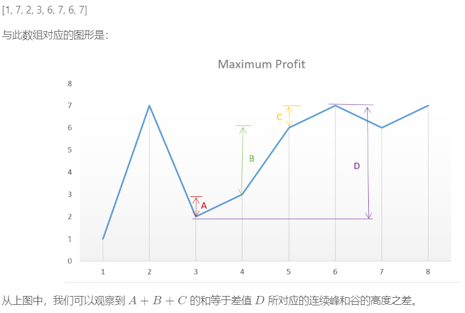

## 分治策略

分治策略是经常用到的一种算法思想。一般和递归会在一起使用。

分治策略在每层的递归应用中，有如下三个步骤：

* 分解

* 解决

* 合并

当子问题足够大，需要递归求解时，我们称之为**递归情况**。当子问题变得足够小，不再需要递归时，我们称之为**触底**。此时为基本情况。

**递归式：**

判断递归式的时间复杂度有三种方法：

* 代入法 猜测，数学归纳法证明

* 递归树法 递归式转化为树，判断每层的时间复杂度

* 主方法 => 递归式推导

一般求考虑递归时会忽略细节。例如输入案例默认为2的倍数，以防止出现n/2除不尽的情况。另外还会忽略一些边界条件。

下面来看看分支策略的应用。

### 1.最大子数组问题 分支策略示例一

一个比较有趣的情景是股票问题。股市有跌有降，下图有一个股票的走势图。现在要你买在某一天买入股票，然后在之后一天卖出。要求获利最大的那天。



>图片来自csdn

**解法一：暴力**

不难想到用暴力去解决。我只要遍历这个数组就能找到最大的值，时间复杂度为O(n2)。

**解法二：分治**

那如何用分治策略去解决呢？

首先要转换问题。我们把数组稍作修改，求一个包含每日增长量的数组。每日增长量定义为后一天减前一天。拿此图为例，即`[6,-5,1,3,1,-1,1]`而要求获利，实际上就是求连续的几天的子数组和。这样就转换成了求最大子数组的问题。

>如果数组里没有负数，最大子数组没有意思，因为最大的肯定是整个数组。

用分治法，我们需要将一个问题的规模分成两个大小尽量相等的规模。不难想到就是重点。

这样，在每次递归中，要求的最大子数组无非出现三种情况：

* 完全在左半边=> `0<=target<=mid`

* 完全在右半边=> `mid<target<len`

* 跨越了中点，部分在左部分在右:

`0 <= leftTargetIndex <= mid && mid < rightTargetIndex < len`

第三种情况并不是子问题，因为限定了目标子数组头索引在左，尾索引在右。找的时候只需要从mid开始往两边找就可以了。时间复杂度为O(n)。

下面是第三种情况的伪代码：
```c
FIND-MAX-CROSSING-SUBARRAY(A,low,mid,high)
  left-sum = -无穷 // 表示最小的特殊值，用于判断没选定元素的情况
  sum = 0
  
  for i = mid downto low
    sum += A[i]
    if sum > left-sum
      left-sum = sum  // 记录左边最大
      max-left = i    // 记录此时索引

  right-sum = -无穷
  sum = 0

  for j = mid + 1 to heigh
    sum += A[i]
    if sum > right-sum
      right-sum = sum
      max-right = j

  return (max-left,max-right,left-sum+right-sum)
```

也比较好理解。既然是跨过了中点的，就肯定要包含中点。从中点向两边找，只要找到左边最大子串和右边最大子串，合起来就是最大子串了。

有了上面的处理，就可以对此问题进行分治了

下面是完整的伪代码：
```C
FIND-MAXIMUM-SUBARRAY(A,low,high)
  if high == low
    return (low,high,A[low]) // 递归触底
  else
    mid = [(low+high)/2] // 取中点，[]为向下取整

  // 分别求三种情况的最大子数组
  (left-low,left-high,left-sum) = FIND-MAXIMUM-SUBARRAY(A,low,mid)
  (right-low,right-high,right-sum) = FIND-MAXIMUM-SUBARRAY(A,mid+1,high)
  (cross-low,cross-high,cross-sum) = FIND-CROSSING-SUBARRAY(A,low,mid,high)

  // 三种情况比较，返回最大的
  if left-sum >= right-sum and left-sum >= cross-sum
    return (left-low,left-high,left-sum)
  else if right-sum >= left-sum and right-sum >= cross-sum
    return (right-low,right-high,right-sum)
  else
    return (cross-low,cross-right,cross-sum)
```

算法也比较好理解，每次递归求下去，回溯时求最大的子数组。然后再比较，返回最大的那个。

**时间复杂度分析**

如果假设一次FIND-MAXIMUM-SUBARRAY求问题的时间为`T(n)`,那么开启递归就是`T(n/2)`。这里开启了两个，就是`2*T(n/2)`。故：

* n>1时，`T(n)=2*T(n/2)+'O'(n)`这里的`'O'`是包含最坏最好的情况。

* n=1时，函数返回，`T(n)='O'(1)`

最后得出结论，时间复杂度为O(nlgn),这个可以通过递归树得到。

**注：**

* O(n)表示最坏的情况，即时间复杂度函数的上界。(omiga)(n)表示函数下界，最优情况。还有一个包含了两个情况，是一个O，里面一个工，这里用`'O'`表示。
